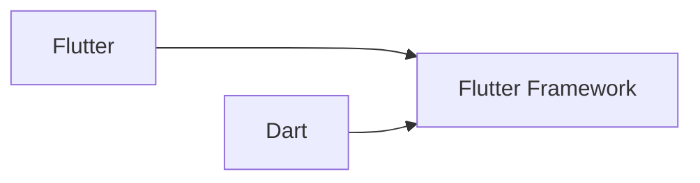

# pengenalan flutter

- **flutter** merupakan tools membuat aplikasi **multi platform** dalam sekali koding (*native cross platform*)

- - **SDK (mesin)** - compile code ke masing2 native platform
  - **framework library** - menggunakan fungsi2 yang disediakan flutter
- menggunakan bahasa **Dart**
  - **object-oriented**
  - gabungan sintaks **JS, Java, C#**
  - dikembangkan **Google**

## cara install flutter

liat url berikut

https://flutter.dev/docs/get-started/install

https://developer.android.com/studio

https://code.visualstudio.com/download