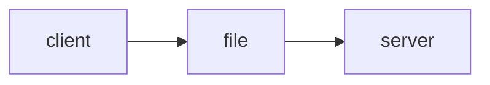

# Integrasi Aplikasi

interaksi antar aplikasi dengan aplikasi lain.

## File sharing

- integrasi dengan **berbagi file** (*.doc, .json, .xls, .csv*)
- paling mudah dilakukan dan masih banyak dilakukan hingga sekarang
- sangat bermanfaat ketika integrasi dengan **aplikasi yg tidak terhubung secara langsung <span style="background-color: yellow;">(offline, beda jaringan, dll.)</span>**



## Database sharing

- memanfaatkan **database** untuk berbagi data

- mudah dilakukan pada aplikasi di tempat (server atau **database) yang sama**.

- hanya perlu **menyimpan data** ke database, dan yang lain tinggal **baca dari database secara langsung**.

- kekurangan: potensi error karena harus dikasih tau akan adanya perubahan.

  ```mermaid
  graph LR;
  	client-->a[(DB)];
  	a[(DB)]-->server;
  ```

  

## Remote Procedure Invocation

- mekanisme dengan menggunakan API

- aplikasi yang ada **membuat API**, aplikasi lainnya tinggal **menggunakan API untuk mengakses resource/data** dari aplikasi tadi.

- sulit, namun populer.

- integrasi dapat dilakukan ***real-time*, kompleksitas internal tidak perlu di-*expose*** ke aplikasi lain <span style="background-color: yellow;">(tidak perlu perantara)</span>.

  ```mermaid
  graph LR;
  	client-->server
  ```

  

## Messaging

- memanfaatkan **message broker** atau **message bus**.

- aplikasi yang punya data mengirim data ke **message broker**, aplikasi yang membutuhkan data akan mengambil data dari message broker.

- sedikit beda dari API, messaging tidak **real time** serta prosesnya **asynchronous** (sedangkan API synchronous dan real time).

  ```mermaid
  graph LR;
  	A[client]-->b[message broker];
  	b[message broker]-->server;
  ```

  
