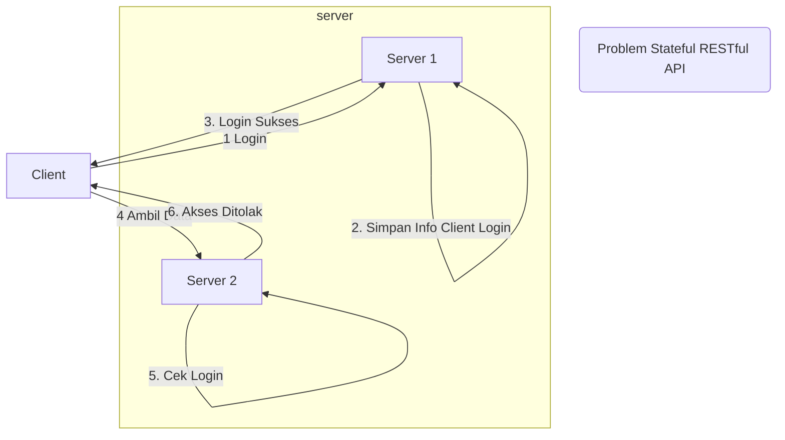
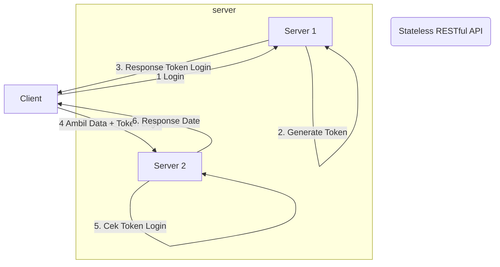

# Stateless

- tidak menyimpan state atau data, yang berarti RESTful API yang baik **tidak pernah menyimpan state/data antar request**.
- Setiap request dari client ke server **harus berisikan semua informasi lengkap** yang dibutuhkan oleh server.
- client bertanggung jawab **menyimpan dan melakukan manajemen state** yang berhubungnan dengan client.
- stateless artinya setiap HTTP request adalah **proses independen**, tidak bergantung dengan HTTP request lainnya.
- server tidak boleh bergantung dengan request dari client sebelumnya.

## Keuntungan Stateless RESTful API

- **mudah di-*scaling horizontal*** karena request dari client bisa masuk ke server mana saja, sehingga untuk scaling hanya tinggal menambah server baru.
- **sederhana** karena tidak perlu tahu state sebelumnya yang sangat kompleks.
- setiap request client akan **sangat lengkap** sehingga mudah untuk di track dan di cek requestnya.

