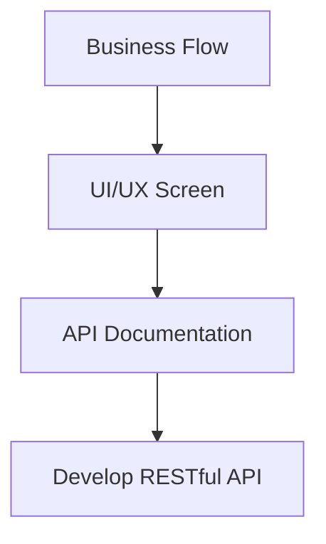

# Development

## Kesalahan umum

- Selalu membuat CRUD API untuk table di database
- Membuat response data sama dengan table di DB
- Membuat API dulu, baru mengerjakan Web/Mobile menggunakan API yang sudah dibuat.
- Mengembalikan data selengkap-lengkapnya di API
- Membuat API yang tidak dibutuhkan client

## Tahapan membuat RESTful API

