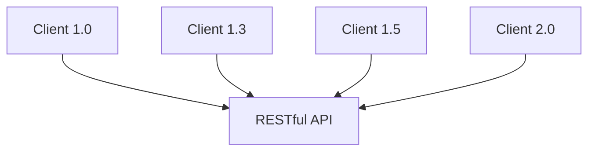

# Maintenance

sangat penting agar RESTful API kita tidak menjadi masalah di kemudian hari. Karena tak jarang kita mungkin mengubah perubahan di screen web/mobile yang sama karena bertambahnya fitur.

## Improvement di Client

## Maintenance yang boleh dilakukan

- menambah data baru di API yang sudah ada
- menambah API yang baru di endpoint URL berbeda
- mempercepat proses API yang sudah ada
- menggabungkan bbrp API menjadi satu tanpa merusak API yang lama

## Maintenance yang tidak boleh dilakukan

- mengubah total response data di API yang sudah ada
- merubah field response data di API yang sudah ada
- menghilangkan API yang sudah ada
- men-split API yang sudah ada menjadi dua atau lebih
- menggabungkan bbrp API menjadi satu sekaligus menghapus API lama