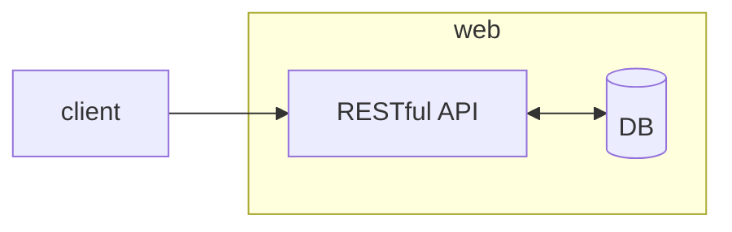

# Pengenalan REST (*RE*presentational *S*tatue *T*ransfer)-ful API

- dikembangkan oleh Roy Fielding (2000)
- memanfaatkan **HTTP protocol** sebagai komunikasinya.
- **lebih sederhana** dibandingkan SOAP (yang juga berjalan di atas protokol HTTP)
- sangat **mudah digunakan** di **semua bahasa pemrograman**.
- menjadi standard API yang banyak digunakan ketika dibutuhkan API untuk pihak lain.

## Mengapa RESTful API?

- menggunakan **HTTP protokol** (*which is * sudah populer).
- cara buatnya **sederhana**.
- **mudah digunakan** oleh client
- **ringan** dan **mudah dimengerti** oleh manusia

