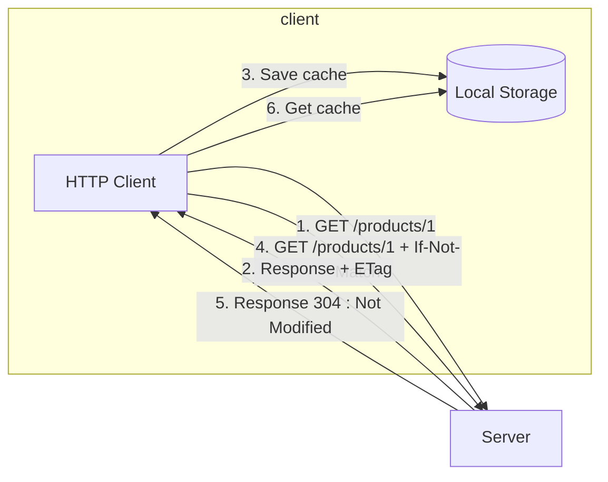

# Caching

- data yang disimpan **sementara di sistem penyimpanan**

- dalam RESTful API, biasanya disimpan di **client**

- biasa digunakan untuk **menurunkan jumlah data transfer** antara client dan server -> proses komunikasi **lebih cepat**.

  > **Tanpa cache**
  >
  > ```mermaid
  > graph LR
  > 	client-. GET /products/1 .->server
  > 	client-. GET /products/1 .->server
  > 	client-. GET /products/1 .->server	
  > 	client-. GET /products/1 .->server	
  > 	client-. GET /products/1 .->server	
  > ```

> **Dengan cache**
>
> ```mermaid
> graph TD
> 	a[HTTP Client]-->| GET /products/1 |b[Server]
> 	b[Server] -- Response --> a[HTTP Client]
> 	subgraph block_a [client]
> 	a[HTTP Client] -- save cache --> c[(Local Storage)]
> 	end	
> ```

## HTTP Header Response ETag

- **menambah informasi thdp resource yg dikembalikan di server**
- berisi **versi resource** yang diminta

## HTTP Header Request If-Not-Match

- setelah menyimpan data cache, setiap client mengirim request ke server, client akan menambahkan **HTTP Header If-Not-Match**
- HTTP Header If-Not-Match berisi **data ETag sebelumnya**.
- Jika data **tidak berubah**, diperoleh response **304 (Not Modified)**




